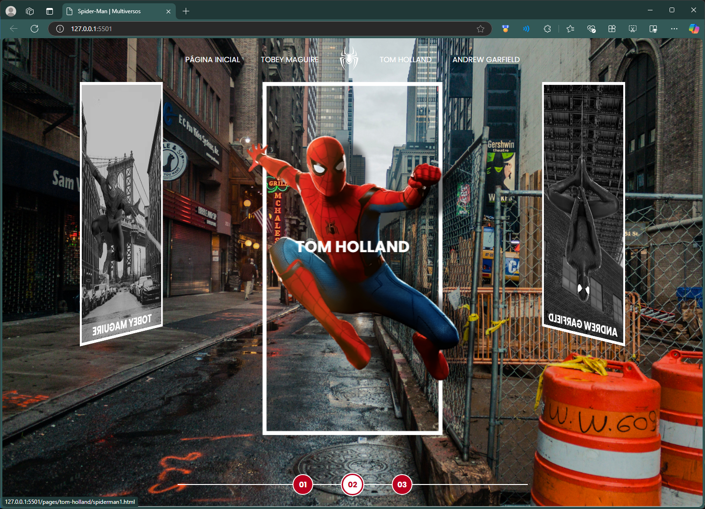
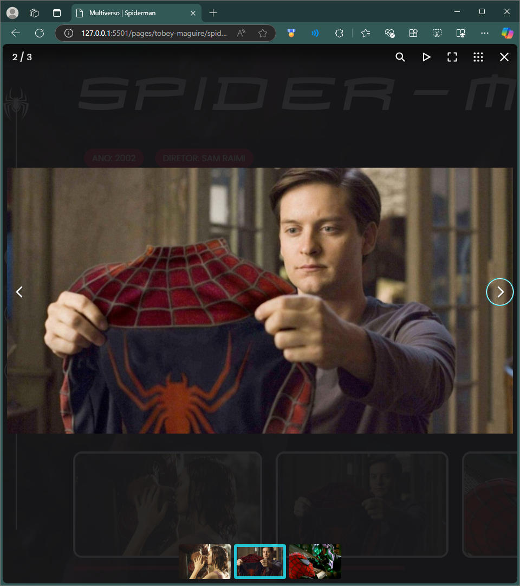
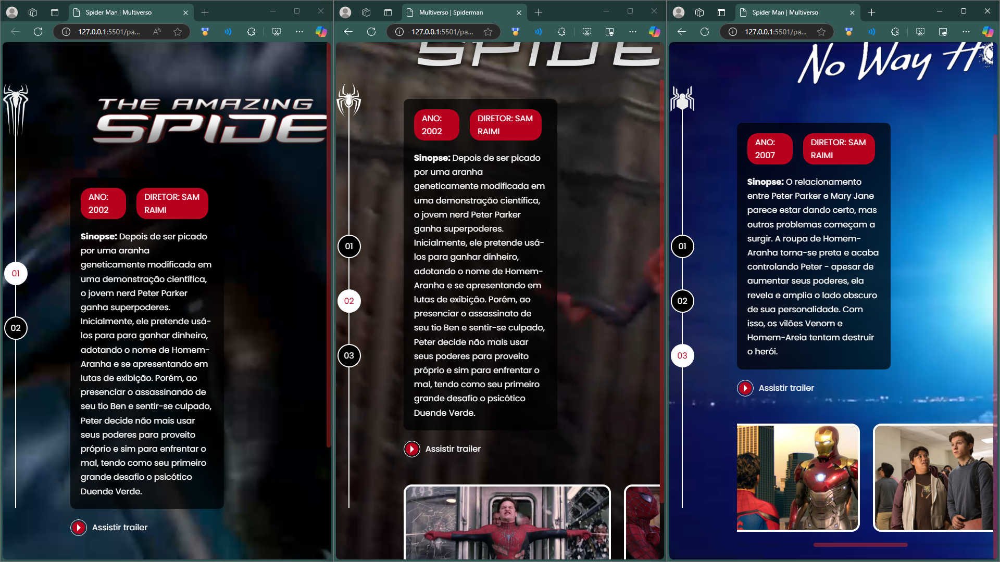
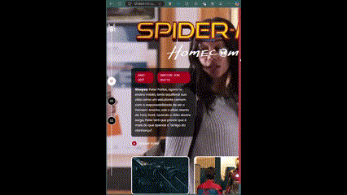

# Live Spider-Man Multiversos

Projeto (fork) de uma página HTML exibindo as três versões _live-action_ e suas atuais filmografias (2024).

## Alterações

- [ ] Adição de `alt` faltantes;
- [ ] Refatoração do script para `selectCarouselItem()` e separação de `s-cards-carousel` para o arquivo `.css`;
- [ ] Redirecionamento aplicado aos `.s-menu__item`;
- [ ] Refatoramentos de acessibilidade;
- [ ] Refatoramento das páginas com Fancybox Script;

- [ ] Refatoramento de layout das páginas dos atores;

- [ ] Implementação de `.css` e `<script>` de scrolls temáticos;

